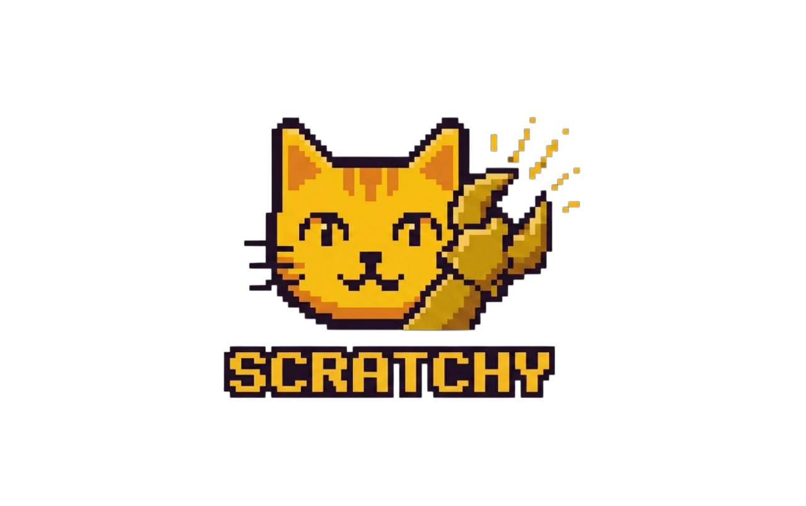

<p align="center"></p>

<h1 align="center">Scratchy</h1>

<p align="center"><em>AI that shows you things, not just tells you.</em></p>

<p align="center">
  
  
  
</p>

<p align="center">
  <a href="https://v2.clawos.fr">Live Demo</a> ·
  <a href="#quick-start">Quick Start</a> ·
  <a href="#self-hosting">Self-Host</a> ·
  <a href="https://discord.gg/clawd">Discord</a>
</p>

---

## Table of Contents

- [Quick Start](#quick-start)
- [What Is Scratchy?](#what-is-scratchy)
- [GenUI: Agents That Render UI](#genui-agents-that-render-ui)
- [Meet The Team](#meet-the-team)
- [Built-in Widgets](#built-in-widgets)
- [What's Free vs Paid](#whats-free-vs-paid)
- [Pricing](#pricing)
- [Self-Hosting Guide](#self-hosting-guide)
- [Architecture](#architecture)
- [Security](#security)
- [API Reference](#api-reference)
- [Configuration](#configuration)
- [Testing](#testing)
- [Contributing](#contributing)

---

## Quick Start

```bash
git clone https://github.com/yassinebkr/scratchy.git
cd scratchy
cp .env.example .env         # Add your API keys
docker compose up -d         # That's it
```

Open `http://localhost:3002`. First signup = admin.

<details>
<summary>No Docker? Manual setup</summary>

Node.js ≥ 22:

```bash
npm ci --legacy-peer-deps
export ENCRYPTION_KEY=$(node -e "console.log(require('crypto').randomBytes(32).toString('hex'))")
npm start
```

</details>

---

## What Is Scratchy?

Most AI chat apps give you a text box and a stream of paragraphs. Scratchy gives you a **canvas**.

When you ask an agent to show you server metrics, it renders gauges. When you ask for a comparison, it builds a table. When you ask it to help you write an email, it shows a compose form. The agent decides what to show — you see interactive components, not walls of text.

This is **Generative UI (GenUI)**: a protocol where agents describe UI declaratively, and the client renders it in real-time as tokens stream in. 34 component types — charts, forms, timelines, checklists, code blocks, cards, and more.

And it's not one agent — you choose from specialized agents, each with their own personality and expertise.

---

## GenUI: Agents That Render UI 🎨

Traditional AI chat:
> "Here's a table showing your server stats: CPU is at 73%, RAM is 4.2GB..."

Scratchy:
> *Three gauges appear showing CPU (73%, orange), RAM (4.2/8 GB, blue), Disk (52%, green). A stats grid shows uptime, request count, and error rate. All rendered live as the agent streams.*

The agent writes declarative ops. The client renders components. No iframe hacks, no markdown tables pretending to be UI. Real interactive elements with hover states, click handlers, and live updates.

**34 component types:** `hero`, `card`, `stats`, `gauge`, `progress`, `sparkline`, `chart-bar`, `chart-line`, `chart-pie`, `table`, `checklist`, `timeline`, `form`, `buttons`, `tabs`, `accordion`, `code`, `image`, `video`, and more.

---

## Meet The Agents 👥

Scratchy ships with 4 specialist agents — each with a distinct personality, expertise, and soul file:

| Agent | Role | What It Does |
|-------|------|-------------|
| **Atlas** | Code Architect | Systems-first coding. Plans architecture, then implements. Production-ready with proper error handling. |
| **Iris** | Design Engineer | UI/UX that works beautifully. Mobile-first, accessible, with proper design tokens. |
| **Nova** | Researcher | Finds, cross-references, and synthesizes information. Always cites sources, always flags uncertainty. |
| **Echo** | Writer | Clear, sharp writing. Docs, marketing copy, emails — no AI slop. Every sentence earns its place. |

Switch between agents depending on the task. Each agent uses GenUI canvas tools to render structured output — not just text.

**Coming soon:** Multi-agent team delegation, where an orchestrator splits complex requests across agents in parallel.

---

## Built-in Widgets 🧩

Three open-core widgets ship with every Scratchy instance:

| Widget | What It Does |
|--------|-------------|
| **Notes** | Create, edit, search notes. Agents can read and write to your notes contextually. |
| **Calendar** | Events with colors, date ranges, and reminders. Agents can check your schedule. |
| **Email** | Gmail integration via OAuth. Agents can read your inbox and pre-fill compose forms — but [only you can hit Send](#security). |

All widget data is per-user, stored in SQLite, and never leaves your server.

---

## What's Free vs Paid

The open-core version includes everything you need to run a personal AI workspace:

| ✅ Free (self-hosted) | 💰 Paid (managed hosting) |
|------------------------|---------------------------|
| GenUI canvas (all 34 components) | Managed hosting (zero setup) |
| 4 specialist agents (Atlas, Iris, Nova, Echo) | Multi-user + seat management |
| Notes, Calendar, Email widgets | Opus model access |
| Streaming chat with TOON encoding | Priority support |
| Single-user workspace | Advanced quotas + analytics |
| BYOK (bring your own API keys) | — |
| Self-hosted, your data stays yours | — |

**Coming soon:** MCP tool integration, widget marketplace, i18n (language translations).

**The free version is real.** Not a demo, not a 14-day trial. Fork it, self-host it, build on it.

---

## Pricing 💰

Self-hosted is free forever. Managed hosting plans:

| Plan | Price | Highlights |
|------|-------|-----------|
| **Free** | €0 | Self-hosted, single-user, BYOK, all features |
| **Pro** | €29.99/mo | Managed hosting, Sonnet, 200 msg/day, 1 seat |
| **Max** | €59.99/mo | Managed hosting, Sonnet + Opus, 500 msg/day, 3 seats |
| **Business** | Custom | On-prem or managed, unlimited seats, SLA |

---

## Self-Hosting Guide 🚀

### Requirements
- Node.js ≥ 22 (or Docker)
- 1 CPU, 512MB RAM minimum (2 CPU / 2GB recommended)
- SQLite (included, no external DB needed)

### Docker Compose (recommended)

```bash
git clone https://github.com/yassinebkr/scratchy.git
cd scratchy
cp .env.example .env
```

Edit `.env`:

```env
ENCRYPTION_KEY=<generate with: node -e "console.log(require('crypto').randomBytes(32).toString('hex'))">
OPENAI_API_KEY=sk-...
# Optional:
ANTHROPIC_API_KEY=sk-ant-...
GOOGLE_CLIENT_ID=...
GOOGLE_CLIENT_SECRET=...
```

```bash
docker compose up -d
```

### Manual (Node.js)

```bash
npm ci --legacy-peer-deps
export ENCRYPTION_KEY=$(node -e "console.log(require('crypto').randomBytes(32).toString('hex'))")
export OPENAI_API_KEY=sk-...
npm start
```

Server starts on port 3002. Override with `PORT=8080 npm start`.

### Reverse Proxy

Scratchy uses WebSocket — make sure your proxy passes `Upgrade` headers. Nginx example:

```nginx
location / {
    proxy_pass http://127.0.0.1:3002;
    proxy_http_version 1.1;
    proxy_set_header Upgrade $http_upgrade;
    proxy_set_header Connection "upgrade";
    proxy_set_header Host $host;
}
```

---

## Architecture 🏗️

```
Browser (Web Components)
  ├── sc-chat          Chat interface + streaming
  ├── sc-canvas        GenUI component renderer (34 types)
  ├── sc-terminal      Terminal surface
  └── sc-editor        Code editor surface
       │
       │ WebSocket
       ▼
Server (Node.js)
  ├── Router           HTTP API + static serving
  ├── WS Handler       Per-client state, broadcast
  ├── Auth             Argon2id + sessions + WebAuthn passkeys
  ├── Protocol         GenUI parser, TOON codec, surfaces, A2UI bridge
  ├── State            SQLite WAL (users, agents, canvas, memory, prefs)
  ├── Widgets          Notes, Calendar, Email backends
  └── Libraries        Embeddings, Crawler, Billing, Indexer
       │
       │ LLM API calls
       ▼
Anthropic / OpenAI / Google APIs
```

### Tech Stack

| Layer | Tech |
|-------|------|
| Frontend | Web Components (no framework), Shadow DOM, ES modules |
| Backend | Node.js 22, native HTTP server, `ws` package |
| Database | SQLite with WAL mode |
| Auth | Argon2id, AES-256-GCM, WebAuthn |
| Agent Runtime | Direct API (Anthropic, OpenAI, Google) |
| Encoding | TOON (Token-Oriented Object Notation, ~30% token savings) |

---

## Security 🔒

Self-hosted means your data never leaves your server. Auth uses Argon2id password hashing and AES-256-GCM encryption for stored API keys. WebAuthn passkeys supported.

### Email Security Model

Scratchy enforces a **structural security boundary** on email sending. This is not a config flag — it's an architectural constraint.

<details>
<summary>Email Security Details</summary>

| Action | Agent (WS) | Human (REST) |
|--------|-----------|-------------|
| Read inbox | ✅ `mail-inbox` | ✅ `GET /api/emails` |
| Search | ✅ `mail-search` | — |
| View email | ✅ `mail-read` | ✅ `GET /api/emails/:id` |
| Pre-fill compose | ✅ `mail-compose` | ✅ `POST /api/emails` |
| Save draft | ✅ `mail-save-draft` | ✅ `POST /api/emails` |
| **Send** | **❌ No action exists** | **✅ `POST /api/emails/:id/send`** |

The email widget module has no send function. The send endpoint lives in a REST-only handler unreachable from the WebSocket path. Gmail OAuth scopes are `gmail.readonly` + `gmail.compose` — no `gmail.send`.

**Why structural enforcement?** A config flag is an attack surface. A prompt instruction is ignorable. Code separation survives prompt injection, config bugs, and future changes.

</details>

---

## API Reference

<details>
<summary>Core API Endpoints</summary>

### Core

| Method | Path | Auth | Description |
|--------|------|------|-------------|
| GET | `/api/health` | No | Health check |
| POST | `/api/auth/signup` | No | Create account |
| POST | `/api/auth/login` | No | Login |
| GET | `/api/auth/me` | Yes | Current user |
| POST | `/api/auth/logout` | Yes | End session |

### Agents

| Method | Path | Auth | Description |
|--------|------|------|-------------|
| GET | `/api/agents` | Yes | List agents |
| POST | `/api/agents` | Yes | Create agent |
| GET/PUT/DELETE | `/api/agents/:id` | Yes | Agent CRUD |

### Widgets

| Method | Path | Auth | Description |
|--------|------|------|-------------|
| GET/POST | `/api/notes` | Yes | List / create notes |
| GET/PUT/DELETE | `/api/notes/:id` | Yes | Note CRUD |
| GET/POST | `/api/calendar` | Yes | List / create events |
| GET/PUT/DELETE | `/api/calendar/:id` | Yes | Event CRUD |
| GET/POST | `/api/emails` | Yes | List / create drafts |
| GET/DELETE | `/api/emails/:id` | Yes | Draft CRUD |
| POST | `/api/emails/:id/send` | Yes | Send via Gmail (human-only) |

### Admin

| Method | Path | Auth | Description |
|--------|------|------|-------------|
| GET/PUT | `/api/admin/config` | Admin | System configuration |
| GET | `/api/admin/users` | Admin | User management |
| GET/PUT | `/api/admin/users/:id/quotas` | Admin | Quota management |

### WebSocket

Connect to `ws://HOST:3002/ws?token=<session-token>`. See [PROTOCOL.md](./PROTOCOL.md) for the full message spec.

</details>

---

## Configuration

<details>
<summary>Environment Variables</summary>

| Variable | Required | Description |
|----------|----------|-------------|
| `ENCRYPTION_KEY` | **Yes** | 32-byte hex key for AES-256-GCM |
| `OPENAI_API_KEY` | **Yes** | OpenAI API key (embeddings + chat) |
| `PORT` | No | Server port (default: 3002) |
| `DATABASE_PATH` | No | SQLite path (default: `./data/scratchy.db`) |
| `ANTHROPIC_API_KEY` | No | For Claude models |
| `GOOGLE_CLIENT_ID` | No | Gmail + Calendar OAuth |
| `GOOGLE_CLIENT_SECRET` | No | OAuth client secret |
| `GOOGLE_REDIRECT_URI` | No | OAuth callback URL |
| `STRIPE_SECRET_KEY` | No | Billing |
| `STRIPE_WEBHOOK_SECRET` | No | Stripe webhooks |

</details>

---

## Testing 🧪

```bash
npm test              # Run all tests
npm run test:verbose  # Verbose output
```

Uses Node.js built-in test runner. No external framework.

### Project Structure

```
scratchy/
├── server/              # HTTP server, WS handler, auth, routes
├── protocol/            # GenUI, TOON, surfaces, A2UI bridge
├── state/               # SQLite state managers (users, agents, canvas, memory)
├── lib/                 # Google OAuth, embeddings, crawler, billing, widgets
├── public/              # Web Components client (sc-chat, sc-canvas, etc.)
│   ├── components/      # 20+ Web Components
│   ├── lib/             # App bootstrap, WS client
│   ├── styles/          # CSS
│   └── i18n/            # Locale files (en, fr)
├── test/                # Node.js test runner tests
├── docker-compose.yml   # Full stack deployment
├── PROTOCOL.md          # GenUI protocol spec
└── COMPONENTS.md        # Component type reference
```

---

## Contributing

1. Fork → feature branch → PR
2. `node -c` all JS files (syntax check before commit)
3. `npm test` passes
4. ESM imports only (no CommonJS)
5. Components are declarative — agents describe, clients render

---

Built by [Yassine](https://github.com/yassinebkr) • [Discord](https://discord.gg/clawd) • [MIT License](LICENSE)